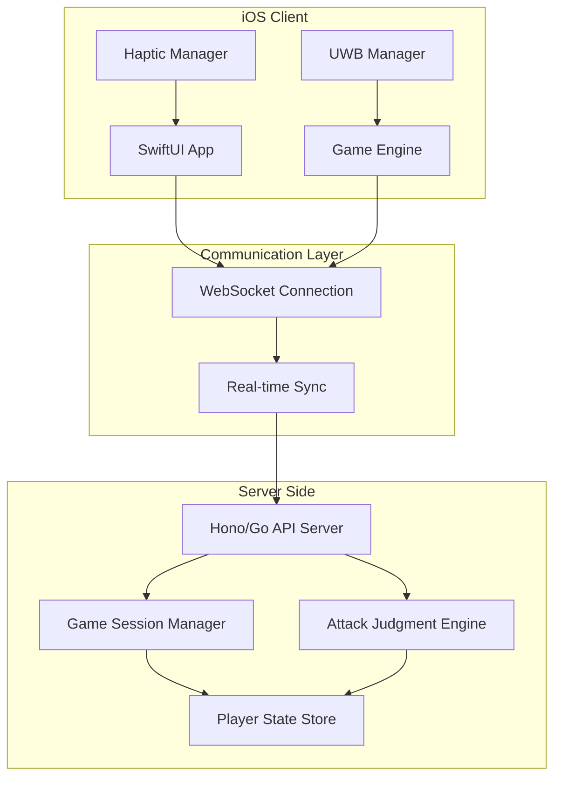
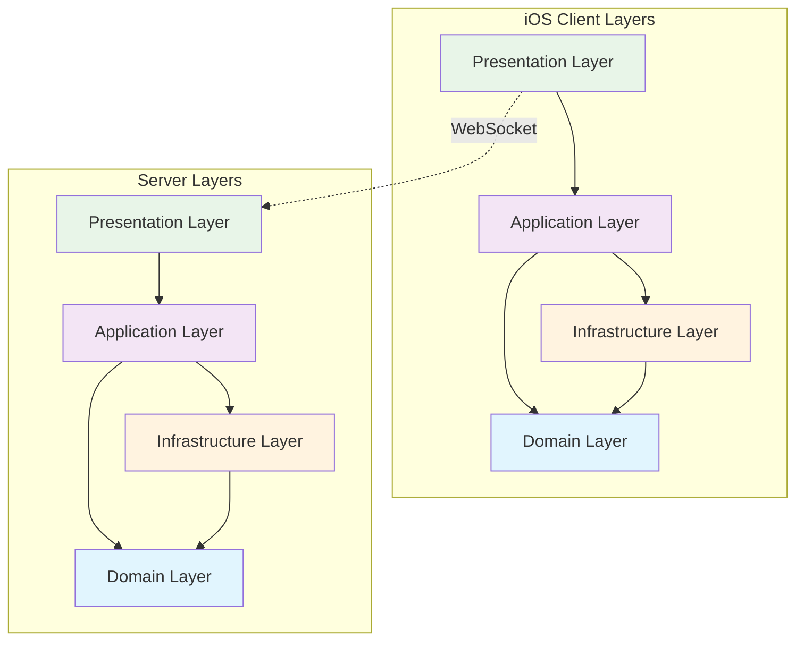

# Design Document

## Overview

リアル版格闘ゲームは、UWB 技術を核とした位置情報ベースの対戦ゲームです。プレイヤーは現実空間で移動しながら、スマートフォンを通じて魔法攻撃を行います。システムは 3 層アーキテクチャ（iOS クライアント、リアルタイム通信層、サーバーサイド処理）で構成されます。

## Architecture



## Project Structure

### iOS Client Folder Structure

```
RealFightingGame/
├── App/
│   ├── RealFightingGameApp.swift
│   └── ContentView.swift
├── Domain/
│   ├── Entities/
│   │   ├── Player.swift
│   │   ├── Position.swift
│   │   ├── AttackAction.swift
│   │   └── GameSession.swift
│   ├── Services/
│   │   ├── GameDomainService.swift
│   │   └── GameRulesService.swift
│   └── Repositories/
│       └── PlayerStateRepository.swift
├── Application/
│   ├── UseCases/
│   │   ├── AttackUseCase.swift
│   │   ├── ManaCollectionUseCase.swift
│   │   └── GameSessionUseCase.swift
│   └── DTOs/
│       ├── AttackResult.swift
│       └── GameEvent.swift
├── Infrastructure/
│   ├── Position/
│   │   ├── UWBPositionService.swift
│   │   ├── FallbackPositionService.swift
│   │   └── PositionService.swift
│   ├── Network/
│   │   ├── WebSocketNetworkService.swift
│   │   ├── NetworkService.swift
│   │   └── GameMessage.swift
│   ├── Haptic/
│   │   ├── CoreHapticsService.swift
│   │   └── HapticService.swift
│   └── Persistence/
│       └── UserDefaultsPlayerRepository.swift
├── Presentation/
│   ├── ViewModels/
│   │   ├── GameViewModel.swift
│   │   └── LobbyViewModel.swift
│   ├── Views/
│   │   ├── GameView.swift
│   │   ├── LobbyView.swift
│   │   └── Components/
│   │       ├── PlayerStatusView.swift
│   │       ├── AttackButtonView.swift
│   │       └── ManaBarView.swift
│   └── Coordinators/
│       └── GameCoordinator.swift
├── DI/
│   ├── DIContainer.swift
│   └── ServiceFactory.swift
└── Resources/
    ├── Assets.xcassets
    ├── Localizable.strings
    └── Info.plist
```

### Server Side Folder Structure (Go)

```
real-fighting-server/
├── cmd/
│   └── server/
│       └── main.go
├── internal/
│   ├── domain/
│   │   ├── entities/
│   │   │   ├── player.go
│   │   │   ├── game_session.go
│   │   │   ├── attack_action.go
│   │   │   └── position.go
│   │   ├── services/
│   │   │   ├── attack_judgment_service.go
│   │   │   ├── game_rules_service.go
│   │   │   └── interfaces.go
│   │   └── repositories/
│   │       ├── session_repository.go
│   │       └── player_repository.go
│   ├── application/
│   │   ├── usecases/
│   │   │   ├── attack_usecase.go
│   │   │   ├── session_usecase.go
│   │   │   └── position_usecase.go
│   │   └── dtos/
│   │       ├── requests.go
│   │       └── responses.go
│   ├── infrastructure/
│   │   ├── websocket/
│   │   │   ├── manager.go
│   │   │   └── handler.go
│   │   ├── persistence/
│   │   │   ├── supabase_session_repository.go
│   │   │   ├── supabase_player_repository.go
│   │   │   ├── supabase_game_history_repository.go
│   │   │   └── database.go
│   │   ├── events/
│   │   │   ├── websocket_publisher.go
│   │   │   └── event_publisher.go
│   │   └── external/
│   │       └── id_generator.go
│   ├── presentation/
│   │   ├── handlers/
│   │   │   ├── game_handler.go
│   │   │   ├── session_handler.go
│   │   │   └── websocket_handler.go
│   │   ├── middleware/
│   │   │   ├── cors.go
│   │   │   └── logging.go
│   │   └── routes/
│   │       └── router.go
│   └── config/
│       ├── config.go
│       └── environment.go
├── pkg/
│   ├── logger/
│   │   └── logger.go
│   └── utils/
│       ├── math.go
│       └── validation.go
├── deployments/
│   ├── cloudflare/
│   │   └── wrangler.toml
│   ├── gcp/
│   │   └── cloudbuild.yaml
│   └── database/
│       ├── migrations/
│       │   ├── 001_create_players.sql
│       │   ├── 002_create_game_sessions.sql
│       │   ├── 003_create_game_history.sql
│       │   └── 004_create_player_stats.sql
│       └── seeds/
│           └── initial_data.sql
├── scripts/
│   ├── build.sh
│   └── deploy.sh
├── go.mod
├── go.sum
└── README.md
```

### Layer Dependencies Diagram



## Components and Interfaces

### iOS Client Architecture (高凝集・低結合設計)

#### Domain Layer (ビジネスロジック)

```swift
// 純粋なビジネスロジック - 外部依存なし
protocol GameDomainService {
    func calculateManaFromDistance(_ distance: Float) -> Int
    func validateAttack(_ attack: AttackAction, playerState: PlayerState) -> ValidationResult
    func calculateAttackDirection(from: Position, to: Position) -> simd_float3
}

protocol PlayerStateRepository {
    func getCurrentState() -> PlayerState
    func updateState(_ state: PlayerState)
    var statePublisher: AnyPublisher<PlayerState, Never> { get }
}
```

#### Application Layer (ユースケース)

```swift
// 各機能の責務を明確に分離
protocol AttackUseCase {
    func executeAttack(chantText: String) async throws -> AttackResult
}

protocol ManaCollectionUseCase {
    func collectManaFromMovement(distance: Float) async
}

protocol GameSessionUseCase {
    func joinGame(sessionId: String) async throws
    func leaveGame() async
}

// 実装例
class AttackUseCaseImpl: AttackUseCase {
    private let positionService: PositionService
    private let networkService: NetworkService
    private let playerRepository: PlayerStateRepository
    private let domainService: GameDomainService

    func executeAttack(chantText: String) async throws -> AttackResult {
        let playerState = playerRepository.getCurrentState()
        let currentPosition = try await positionService.getCurrentPosition()
        let opponentPosition = try await positionService.getOpponentPosition()

        let direction = domainService.calculateAttackDirection(
            from: currentPosition,
            to: opponentPosition
        )

        let attack = AttackAction(
            playerId: playerState.id,
            direction: direction,
            chantText: chantText,
            manaUsed: calculateManaUsage(chantText),
            timestamp: Date()
        )

        let validation = domainService.validateAttack(attack, playerState: playerState)
        guard validation.isValid else { throw validation.error! }

        return try await networkService.sendAttack(attack)
    }
}
```

#### Infrastructure Layer (外部システム連携)

```swift
// UWB位置検出 - 単一責務
protocol PositionService {
    func getCurrentPosition() async throws -> Position
    func getOpponentPosition() async throws -> Position
    func startPositionTracking() async throws
    func stopPositionTracking()
    var positionUpdates: AnyPublisher<Position, Error> { get }
}

class UWBPositionService: PositionService {
    private let nearbyInteraction: NISession
    private let fallbackService: FallbackPositionService

    func getCurrentPosition() async throws -> Position {
        // UWB実装
    }
}

class FallbackPositionService: PositionService {
    private let bluetoothManager: CBCentralManager
    private let motionManager: CMMotionManager

    func getCurrentPosition() async throws -> Position {
        // Bluetooth + センサー実装
    }
}

// ネットワーク通信 - 単一責務
protocol NetworkService {
    func sendAttack(_ attack: AttackAction) async throws -> AttackResult
    func sendPositionUpdate(_ position: Position) async throws
    var gameEvents: AnyPublisher<GameEvent, Error> { get }
}

class WebSocketNetworkService: NetworkService {
    private let webSocket: URLSessionWebSocketTask
    private let encoder: JSONEncoder
    private let decoder: JSONDecoder

    func sendAttack(_ attack: AttackAction) async throws -> AttackResult {
        let message = GameMessage.attack(attack)
        let data = try encoder.encode(message)
        try await webSocket.send(.data(data))

        // レスポンス待機
        let response = try await webSocket.receive()
        return try decoder.decode(AttackResult.self, from: response.data)
    }
}

// 振動フィードバック - 単一責務
protocol HapticService {
    func playAttackFeedback()
    func playDamageFeedback(intensity: Float)
    func playManaCollectionFeedback()
}

class CoreHapticsService: HapticService {
    private let hapticEngine: CHHapticEngine

    func playAttackFeedback() {
        // Core Haptics実装
    }
}
```

#### Presentation Layer (UI)

```swift
// ViewModelは薄く、UseCaseに委譲
class GameViewModel: ObservableObject {
    @Published var playerState: PlayerState = .initial
    @Published var opponentState: PlayerState = .initial
    @Published var gameStatus: GameStatus = .waiting

    private let attackUseCase: AttackUseCase
    private let manaCollectionUseCase: ManaCollectionUseCase
    private let gameSessionUseCase: GameSessionUseCase

    func executeAttack(chantText: String) {
        Task {
            do {
                let result = try await attackUseCase.executeAttack(chantText: chantText)
                await MainActor.run {
                    // UI更新
                }
            } catch {
                // エラーハンドリング
            }
        }
    }
}
```

### Server Side Architecture (高凝集・低結合設計)

#### Domain Layer (Go 実装例)

```go
// ドメインエンティティ
type Player struct {
    ID       string    `json:"id"`
    HP       int       `json:"hp"`
    Mana     int       `json:"mana"`
    Position Position  `json:"position"`
    IsAlive  bool      `json:"isAlive"`
}

type GameSession struct {
    ID      string            `json:"id"`
    Players map[string]*Player `json:"players"`
    Status  SessionStatus     `json:"status"`
    Rules   GameRules         `json:"rules"`
}

// ドメインサービス - 純粋なビジネスロジック
type AttackJudgmentService interface {
    JudgeAttack(attacker Position, direction Vector3, target Position, attackType AttackType) AttackResult
    CalculateDamage(result AttackResult, mana int) int
}

type GameRulesService interface {
    ValidateAttack(attack AttackAction, player *Player) error
    CalculateManaConsumption(chantText string) int
    IsGameFinished(session *GameSession) bool
}
```

#### Application Layer (ユースケース)

```go
// 攻撃処理ユースケース
type AttackUseCase struct {
    sessionRepo     SessionRepository
    judgmentService AttackJudgmentService
    rulesService    GameRulesService
    eventPublisher  EventPublisher
}

func (uc *AttackUseCase) ExecuteAttack(sessionID string, attack AttackAction) (*AttackResult, error) {
    session, err := uc.sessionRepo.GetSession(sessionID)
    if err != nil {
        return nil, err
    }

    attacker := session.Players[attack.PlayerID]
    if err := uc.rulesService.ValidateAttack(attack, attacker); err != nil {
        return nil, err
    }

    // 相手プレイヤーを特定
    var target *Player
    for id, player := range session.Players {
        if id != attack.PlayerID {
            target = player
            break
        }
    }

    // 攻撃判定
    result := uc.judgmentService.JudgeAttack(
        attacker.Position,
        attack.Direction,
        target.Position,
        attack.Type,
    )

    if result.Hit {
        damage := uc.judgmentService.CalculateDamage(result, attack.ManaUsed)
        target.HP -= damage

        if target.HP <= 0 {
            target.IsAlive = false
            session.Status = SessionStatusFinished
        }
    }

    // マナ消費
    attacker.Mana -= uc.rulesService.CalculateManaConsumption(attack.ChantText)

    // セッション更新
    if err := uc.sessionRepo.UpdateSession(session); err != nil {
        return nil, err
    }

    // イベント発行
    event := GameEvent{
        Type:      EventTypeAttack,
        SessionID: sessionID,
        Data:      result,
    }
    uc.eventPublisher.Publish(event)

    return &result, nil
}

// セッション管理ユースケース
type SessionUseCase struct {
    sessionRepo SessionRepository
    playerRepo  PlayerRepository
    idGenerator IDGenerator
}

func (uc *SessionUseCase) CreateSession(player1ID, player2ID string) (*GameSession, error) {
    sessionID := uc.idGenerator.Generate()

    player1, err := uc.playerRepo.GetPlayer(player1ID)
    if err != nil {
        return nil, err
    }

    player2, err := uc.playerRepo.GetPlayer(player2ID)
    if err != nil {
        return nil, err
    }

    session := &GameSession{
        ID: sessionID,
        Players: map[string]*Player{
            player1ID: player1,
            player2ID: player2,
        },
        Status: SessionStatusWaiting,
        Rules:  DefaultGameRules(),
    }

    return session, uc.sessionRepo.CreateSession(session)
}
```

#### Infrastructure Layer

```go
// WebSocket接続管理 - 単一責務
type WebSocketManager struct {
    connections map[string]*websocket.Conn
    mutex       sync.RWMutex
}

func (wsm *WebSocketManager) AddConnection(playerID string, conn *websocket.Conn) {
    wsm.mutex.Lock()
    defer wsm.mutex.Unlock()
    wsm.connections[playerID] = conn
}

func (wsm *WebSocketManager) BroadcastToSession(sessionID string, message []byte) error {
    // セッション内のプレイヤーに配信
}

// データ永続化 - Supabase実装
type SupabaseSessionRepository struct {
    db *sql.DB
}

func (repo *SupabaseSessionRepository) CreateSession(session *GameSession) error {
    query := `
        INSERT INTO game_sessions (id, player1_id, player2_id, status, game_rules)
        VALUES ($1, $2, $3, $4, $5)
    `
    rulesJSON, _ := json.Marshal(session.GameRules)
    _, err := repo.db.Exec(query, session.ID, session.Player1ID, session.Player2ID, session.Status, rulesJSON)
    return err
}

func (repo *SupabaseSessionRepository) GetSession(id string) (*GameSession, error) {
    query := `
        SELECT id, player1_id, player2_id, status, winner_id, start_time, end_time, game_rules, created_at, updated_at
        FROM game_sessions
        WHERE id = $1
    `
    var session GameSession
    var rulesJSON []byte
    err := repo.db.QueryRow(query, id).Scan(
        &session.ID, &session.Player1ID, &session.Player2ID, &session.Status,
        &session.WinnerID, &session.StartTime, &session.EndTime, &rulesJSON,
        &session.CreatedAt, &session.UpdatedAt,
    )
    if err != nil {
        return nil, err
    }

    json.Unmarshal(rulesJSON, &session.GameRules)
    return &session, nil
}

func (repo *SupabaseSessionRepository) UpdateSession(session *GameSession) error {
    query := `
        UPDATE game_sessions
        SET status = $2, winner_id = $3, end_time = $4, updated_at = NOW()
        WHERE id = $1
    `
    _, err := repo.db.Exec(query, session.ID, session.Status, session.WinnerID, session.EndTime)
    return err
}

// イベント配信 - 単一責務
type WebSocketEventPublisher struct {
    wsManager *WebSocketManager
}

func (pub *WebSocketEventPublisher) Publish(event GameEvent) error {
    data, err := json.Marshal(event)
    if err != nil {
        return err
    }

    return pub.wsManager.BroadcastToSession(event.SessionID, data)
}
```

#### Presentation Layer (HTTP/WebSocket Handler)

```go
// HTTPハンドラー - 薄いレイヤー
type GameHandler struct {
    sessionUseCase *SessionUseCase
    attackUseCase  *AttackUseCase
    wsManager      *WebSocketManager
}

func (h *GameHandler) HandleCreateSession(w http.ResponseWriter, r *http.Request) {
    var req CreateSessionRequest
    if err := json.NewDecoder(r.Body).Decode(&req); err != nil {
        http.Error(w, err.Error(), http.StatusBadRequest)
        return
    }

    session, err := h.sessionUseCase.CreateSession(req.Player1ID, req.Player2ID)
    if err != nil {
        http.Error(w, err.Error(), http.StatusInternalServerError)
        return
    }

    w.Header().Set("Content-Type", "application/json")
    json.NewEncoder(w).Encode(session)
}

func (h *GameHandler) HandleWebSocket(w http.ResponseWriter, r *http.Request) {
    conn, err := upgrader.Upgrade(w, r, nil)
    if err != nil {
        return
    }
    defer conn.Close()

    playerID := r.URL.Query().Get("playerId")
    h.wsManager.AddConnection(playerID, conn)

    // メッセージ処理ループ
    for {
        var message GameMessage
        if err := conn.ReadJSON(&message); err != nil {
            break
        }

        switch message.Type {
        case MessageTypeAttack:
            result, err := h.attackUseCase.ExecuteAttack(message.SessionID, message.Attack)
            if err != nil {
                conn.WriteJSON(ErrorMessage{Error: err.Error()})
                continue
            }
            conn.WriteJSON(AttackResultMessage{Result: *result})
        }
    }
}
```

## Data Models

### Database Schema (Supabase/PostgreSQL)

#### Players Table

```sql
CREATE TABLE players (
    id UUID PRIMARY KEY DEFAULT gen_random_uuid(),
    username VARCHAR(50) UNIQUE NOT NULL,
    email VARCHAR(255) UNIQUE NOT NULL,
    total_wins INTEGER DEFAULT 0,
    total_losses INTEGER DEFAULT 0,
    total_games INTEGER DEFAULT 0,
    level INTEGER DEFAULT 1,
    experience_points INTEGER DEFAULT 0,
    created_at TIMESTAMP WITH TIME ZONE DEFAULT NOW(),
    updated_at TIMESTAMP WITH TIME ZONE DEFAULT NOW()
);

CREATE INDEX idx_players_username ON players(username);
CREATE INDEX idx_players_level ON players(level);
```

#### Game Sessions Table

```sql
CREATE TABLE game_sessions (
    id UUID PRIMARY KEY DEFAULT gen_random_uuid(),
    player1_id UUID NOT NULL REFERENCES players(id),
    player2_id UUID NOT NULL REFERENCES players(id),
    status VARCHAR(20) NOT NULL CHECK (status IN ('waiting', 'active', 'finished', 'cancelled')),
    winner_id UUID REFERENCES players(id),
    start_time TIMESTAMP WITH TIME ZONE DEFAULT NOW(),
    end_time TIMESTAMP WITH TIME ZONE,
    game_rules JSONB NOT NULL DEFAULT '{}',
    created_at TIMESTAMP WITH TIME ZONE DEFAULT NOW(),
    updated_at TIMESTAMP WITH TIME ZONE DEFAULT NOW()
);

CREATE INDEX idx_game_sessions_status ON game_sessions(status);
CREATE INDEX idx_game_sessions_players ON game_sessions(player1_id, player2_id);
CREATE INDEX idx_game_sessions_start_time ON game_sessions(start_time);
```

#### Game History Table

```sql
CREATE TABLE game_history (
    id UUID PRIMARY KEY DEFAULT gen_random_uuid(),
    session_id UUID NOT NULL REFERENCES game_sessions(id),
    player_id UUID NOT NULL REFERENCES players(id),
    action_type VARCHAR(20) NOT NULL CHECK (action_type IN ('attack', 'move', 'mana_collect', 'damage_taken')),
    action_data JSONB NOT NULL,
    position_x FLOAT,
    position_y FLOAT,
    position_z FLOAT,
    timestamp TIMESTAMP WITH TIME ZONE DEFAULT NOW()
);

CREATE INDEX idx_game_history_session ON game_history(session_id);
CREATE INDEX idx_game_history_player ON game_history(player_id);
CREATE INDEX idx_game_history_timestamp ON game_history(timestamp);
```

#### Player Stats Table

```sql
CREATE TABLE player_stats (
    id UUID PRIMARY KEY DEFAULT gen_random_uuid(),
    player_id UUID NOT NULL REFERENCES players(id),
    session_id UUID NOT NULL REFERENCES game_sessions(id),
    initial_hp INTEGER NOT NULL DEFAULT 100,
    final_hp INTEGER NOT NULL DEFAULT 0,
    total_damage_dealt INTEGER DEFAULT 0,
    total_damage_taken INTEGER DEFAULT 0,
    total_mana_used INTEGER DEFAULT 0,
    total_distance_moved FLOAT DEFAULT 0,
    attacks_executed INTEGER DEFAULT 0,
    attacks_hit INTEGER DEFAULT 0,
    game_duration_seconds INTEGER,
    created_at TIMESTAMP WITH TIME ZONE DEFAULT NOW()
);

CREATE INDEX idx_player_stats_player ON player_stats(player_id);
CREATE INDEX idx_player_stats_session ON player_stats(session_id);
```

### Application Data Models

#### PlayerState (Runtime)

```swift
struct PlayerState {
    let id: UUID
    var hp: Int
    var mana: Int
    var position: Position
    var isAlive: Bool
    var lastAttackTime: Date?

    // Database fields
    let username: String
    let level: Int
    let experiencePoints: Int
}
```

#### Position

```swift
struct Position {
    let x: Float
    let y: Float
    let z: Float
    let timestamp: Date
    let accuracy: Float
}
```

#### AttackAction

```swift
struct AttackAction {
    let playerId: UUID
    let sessionId: UUID
    let direction: simd_float3
    let chantText: String
    let manaUsed: Int
    let timestamp: Date
    let attackType: AttackType
}

enum AttackType: String, CaseIterable {
    case fireball = "fireball"
    case lightning = "lightning"
    case heal = "heal"
    case shield = "shield"
}
```

#### GameSession

```go
type GameSession struct {
    ID        string            `json:"id" db:"id"`
    Player1ID string            `json:"player1_id" db:"player1_id"`
    Player2ID string            `json:"player2_id" db:"player2_id"`
    Status    SessionStatus     `json:"status" db:"status"`
    WinnerID  *string           `json:"winner_id" db:"winner_id"`
    StartTime time.Time         `json:"start_time" db:"start_time"`
    EndTime   *time.Time        `json:"end_time" db:"end_time"`
    GameRules map[string]interface{} `json:"game_rules" db:"game_rules"`
    CreatedAt time.Time         `json:"created_at" db:"created_at"`
    UpdatedAt time.Time         `json:"updated_at" db:"updated_at"`

    // Runtime fields (not stored in DB)
    Players   map[string]*Player `json:"players,omitempty" db:"-"`
}

type SessionStatus string

const (
    SessionStatusWaiting   SessionStatus = "waiting"
    SessionStatusActive    SessionStatus = "active"
    SessionStatusFinished  SessionStatus = "finished"
    SessionStatusCancelled SessionStatus = "cancelled"
)
```

### Database Repository Interfaces

```go
type PlayerRepository interface {
    CreatePlayer(player *Player) error
    GetPlayer(id string) (*Player, error)
    GetPlayerByUsername(username string) (*Player, error)
    UpdatePlayer(player *Player) error
    UpdatePlayerStats(playerID string, wins, losses int) error
}

type SessionRepository interface {
    CreateSession(session *GameSession) error
    GetSession(id string) (*GameSession, error)
    UpdateSession(session *GameSession) error
    GetActiveSessionsByPlayer(playerID string) ([]*GameSession, error)
    EndSession(sessionID string, winnerID *string) error
}

type GameHistoryRepository interface {
    RecordAction(sessionID, playerID string, actionType string, actionData map[string]interface{}, position *Position) error
    GetSessionHistory(sessionID string) ([]*GameHistoryEntry, error)
    GetPlayerHistory(playerID string, limit int) ([]*GameHistoryEntry, error)
}

type PlayerStatsRepository interface {
    CreateSessionStats(sessionID, playerID string, initialHP int) error
    UpdateSessionStats(sessionID, playerID string, stats *PlayerSessionStats) error
    GetPlayerStats(playerID string) (*PlayerStats, error)
}
```

## Error Handling

### UWB Fallback Strategy

1. **Primary**: UWB (Nearby Interaction Framework)
2. **Secondary**: Bluetooth Low Energy + 加速度センサー
3. **Tertiary**: GPS + コンパス + 歩数計

### Network Error Handling

```swift
enum GameError: Error {
    case uwbNotAvailable
    case networkConnectionLost
    case invalidAttackAction
    case insufficientMana
    case gameSessionExpired
}
```

### Server Side Error Recovery

- WebSocket 接続断絶時の自動再接続
- セッション状態の定期的なバックアップ
- プレイヤー離脱時の適切なゲーム終了処理

## Testing Strategy

### Unit Testing

- UWBManager: モック位置データでの距離・方向計算テスト
- GameEngine: 攻撃判定ロジックのテスト
- AttackJudgmentEngine: 様々な攻撃パターンでの判定テスト

### Integration Testing

- iOS-Server 間のリアルタイム通信テスト
- UWB 位置情報とサーバー同期のテスト
- 複数プレイヤーでの同時攻撃処理テスト

### End-to-End Testing

```swift
func testCompleteGameFlow() async throws {
    // 1. ゲームセッション作成
    // 2. プレイヤー参加
    // 3. 位置情報同期
    // 4. 攻撃実行
    // 5. ダメージ計算
    // 6. ゲーム終了
}
```

### Performance Testing

- UWB 位置更新頻度の最適化（目標: 30Hz）
- WebSocket 通信レイテンシ測定（目標: <100ms）
- バッテリー消費量の監視

## Security Considerations

### Position Data Protection

- 位置情報の暗号化送信
- ゲーム終了後の位置データ削除
- プライバシー設定の尊重

### Anti-Cheat Measures

- サーバーサイドでの攻撃判定検証
- 異常な移動速度の検出
- 位置情報の整合性チェック

## Deployment Architecture

### Cloudflare Workers Option

```typescript
// Durable Objects for session management
export class GameSessionDO {
  constructor(private state: DurableObjectState) {}

  async handleWebSocket(request: Request): Promise<Response> {
    // WebSocket handling logic
  }
}
```

### GCP Cloud Run Option

```go
// Go implementation with gorilla/websocket
func handleGameSession(w http.ResponseWriter, r *http.Request) {
    conn, err := upgrader.Upgrade(w, r, nil)
    if err != nil {
        return
    }
    defer conn.Close()

    // Game session logic
}
```

## Database Configuration

### Supabase Setup

```go
// Database connection configuration
type DatabaseConfig struct {
    Host     string
    Port     int
    Database string
    Username string
    Password string
    SSLMode  string
}

func NewSupabaseConnection(config DatabaseConfig) (*sql.DB, error) {
    dsn := fmt.Sprintf("host=%s port=%d user=%s password=%s dbname=%s sslmode=%s",
        config.Host, config.Port, config.Username, config.Password, config.Database, config.SSLMode)

    db, err := sql.Open("postgres", dsn)
    if err != nil {
        return nil, err
    }

    // Connection pool settings
    db.SetMaxOpenConns(25)
    db.SetMaxIdleConns(5)
    db.SetConnMaxLifetime(5 * time.Minute)

    return db, db.Ping()
}
```

### Environment Variables

```bash
# Supabase configuration
SUPABASE_URL=https://your-project.supabase.co
SUPABASE_ANON_KEY=your-anon-key
SUPABASE_SERVICE_ROLE_KEY=your-service-role-key

# Database connection (for server-side)
DATABASE_HOST=db.your-project.supabase.co
DATABASE_PORT=5432
DATABASE_NAME=postgres
DATABASE_USER=postgres
DATABASE_PASSWORD=your-password
DATABASE_SSL_MODE=require
```

### Migration Strategy

```go
// Migration runner
type MigrationRunner struct {
    db *sql.DB
}

func (mr *MigrationRunner) RunMigrations() error {
    migrations := []string{
        "001_create_players.sql",
        "002_create_game_sessions.sql",
        "003_create_game_history.sql",
        "004_create_player_stats.sql",
    }

    for _, migration := range migrations {
        if err := mr.runMigration(migration); err != nil {
            return fmt.Errorf("failed to run migration %s: %w", migration, err)
        }
    }
    return nil
}
```

### Real-time Features with Supabase

```typescript
// iOS側でSupabase Realtimeを使用
import { createClient } from "@supabase/supabase-js";

const supabase = createClient(supabaseUrl, supabaseAnonKey);

// ゲームセッションの変更を監視
const subscription = supabase
  .channel("game_sessions")
  .on(
    "postgres_changes",
    { event: "UPDATE", schema: "public", table: "game_sessions" },
    (payload) => {
      // セッション状態の更新を処理
      handleSessionUpdate(payload.new);
    }
  )
  .subscribe();
```
