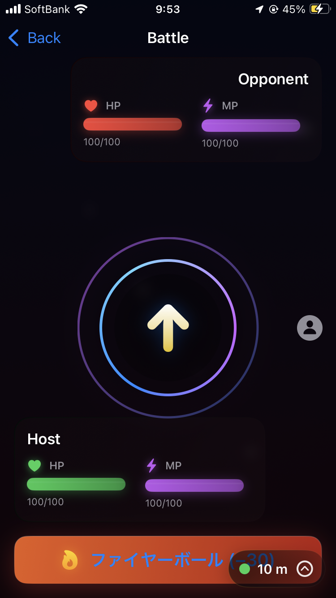

# 魔法少女になりたい

READMEもっと更新します！！
## 製品概要
### 背景(製品開発のきっかけ、課題等）
従来のモバイルゲームは画面を見ながら指で操作するものが主流でしたが、これでは動かず完結してしまい、運動不足やコミュニケーション不足といった課題があります。また、ARゲームは存在しますが、実際に体を動かして対戦するゲームは限られていました。
また、運動不足を訴える人に聞き込みをしたところ、運動しないと行けないな〜とは思うけど別に家で他のことしてたほうが楽しいしとなっている人が一定数いました。
そこで私たちは「絶対に外に出たくなるワクワクするゲーム」を作ることで、これらの課題を解決したいと考えました。

### 製品説明（具体的な製品の説明）
リアル版格闘ゲームは、~~UWB（Ultra-Wideband）技術~~か(今回は実装が間に合わずGPSを使用しています)を活用した位置情報ベースの対戦ゲームです。プレイヤーは魔法少女として現実空間を移動しながら、スマートフォンを通じて相手に魔法攻撃を行います。

- **現実世界での対戦**: プレイヤーは実際に公園や広場で動き回りながら対戦
- **~~UWB位置検出~~GPS**: 高精度な位置情報で相手の位置をリアルタイム把握
- **魔法攻撃システム**: スマートフォンの向きと詠唱で攻撃を実行
- **マナ回収システム**: 走ることでマナを回収し、継続的な攻撃が可能

### 特長
#### 1. 高精度位置検出システム
~~UWB技術を~~GPSを主軸とし、Bluetooth Low Energy + 加速度センサーをフォールバックとして使用。相手プレイヤーの位置をリアルタイムで高精度に検出します。

#### 2. リアルタイム対戦システム
WebSocket通信による低遅延なリアルタイム同期。攻撃判定、HP/MP管理、位置情報の同期を瞬時に処理します。

#### 3. 没入感のあるゲーム体験
Core Hapticsによる振動フィードバック、詠唱による攻撃システム、実際の移動によるマナ回収など、現実世界とゲームが融合した体験を提供します。

### 解決出来ること
- **運動不足の解消**: 実際に体を動かすことで健康的なゲーム体験
特に、戦闘に勝つためには早いタイミングで切れるMPを回復させながら戦う必要があるが、MPの回復は早く走るほど早く回復する仕様のため、自然と運動量が増える設計をした。
- **コミュニケーション促進**: 現実世界での対戦により、新しい出会いと交流を創出
- **技術的挑戦**: UWB技術の実用化により、新しい位置情報活用の可能性を提示
現状端末同士の距離は高精度で取ることができているので、現在起点となるポイントを３点用意し、余弦定理を用いた相対的な距離の算出の実装に取り掛かり中
- **エンターテイメントの進化**: デジタルとリアルの境界を超えた新しいゲーム体験

### 今後の展望
- ＊＊攻撃判定の精度の拡充**: uwbによる高精度な位置判定を実装する
- **マルチプレイヤー対応**: 3人以上の同時対戦機能
- ＊＊お散歩**機能の追加: 短期的な運動だけでなく長期的にも身体を動かす機能を追加する
- **AR要素の追加**: カメラを使った魔法エフェクトの表示
絶対に見れたら楽しいので頑張ります
- **大会・イベント開催**: リアル版格闘ゲームの公式大会の開催
- **ステージ拡張**: 様々な場所での対戦ステージの追加
- **AI対戦相手**: 一人でも楽しめるAI対戦機能

### 注力したこと（こだわり等）
* **技術的挑戦**: ~~UWB技術の実用化に挑戦し、高精度な位置検出システムを構築~~
* **リアルタイム性**: WebSocket通信とサーバーサイド処理により、低遅延な対戦体験を実現
* **ユーザビリティ**: 直感的な操作と分かりやすいUI/UXの設計
* **スケーラビリティ**: モノレポ構成とクリーンアーキテクチャによる保守性の高い設計
* **CI/CDへの挑戦**: 開発初期の段階からGoogle CloudへのGitHub Actionを利用したデプロイのワークフローの構築を行った。

## 開発技術
### 活用した技術
#### API・データ
* **PostgreSQL(Supabase)**: プレイヤー情報、ゲームセッション、位置ログの管理
* **WebSocket**: リアルタイム通信による低遅延対戦
* **JWT**: セキュアな認証トークン管理

#### フレームワーク・ライブラリ・モジュール
* **iOS (SwiftUI)**: ネイティブiOSアプリケーション
* **Go**: 高性能なサーバーサイド処理
* **Nearby Interaction Framework**: UWB位置検出
* **Core Location**: GPS位置情報のフォールバック

#### デバイス
* **iPhone**: UWB対応デバイスでの位置検出
* **Apple Watch**: 補助的なセンサーデータ収集（将来拡張）
* **Bluetooth Low Energy**: UWBフォールバック用通信

### 独自技術
#### ハッカソンで開発した独自機能・技術
UWBが謎のばぐで動かなかったのでGPSで実装してます！！
* **リアルタイム対戦エンジン**: WebSocket通信による低遅延ゲーム同期
  - 実装ファイル: `Server/internal/session/session_manager.go`
  - 攻撃判定システム: サーバーサイドでの公正な判定処理

* **魔法攻撃システム**: 詠唱とスマートフォンの向きによる攻撃実行
  - 実装ファイル: `Server/internal/game/hpmp/handler.go`
  - マナ管理システム: 移動距離に応じたマナ回収機能

* **クリーンアーキテクチャ**: 高凝集・低結合な設計による保守性の向上
  - iOS: Domain/Application/Infrastructure/Presentation層の分離
  - Server: エンティティ/リポジトリ/ユースケース/ハンドラーの分離
